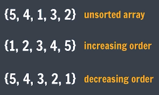
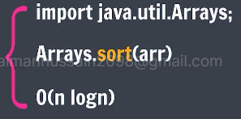
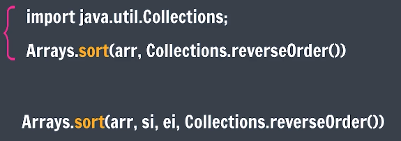

# Sorting
To arrange in a particular order

# Basic Sorting Techniques/Algorithms.
1. Bubble Sort
2. Selection Sort
3. Insertion Sort
4. Counting Sort

# Bubble Sort
Idea - Large elements come to the end of the array by swappig with adjacent elements. 

Bubble sort is a sorting algorithm that starts from the first element of an array and compares it with the second element. If the first element is greater than the second, we swap them. It continues this process until the end of the array, with the largest elements “bubbling” to the top i.e., pushing the largest element at the end of array.

# Selection Sort
Idea - pick the smallest (from the unsorted array) and put it in the beginning. 

# Insertion Sort
Idea - The array is virtually split into a sorted and an unsorted part. Values from the unsorted part are picked and placed in the correct position in the sorted part.

- Inbuilt Sort
Java contains inbuild functions which allows sorting in a single line (unlike done previously). 

Array.sort(arr, si, ei) : refers to a function for sorting a sub-section of an array in Java. 
1. si: indicates the starting index (inclusive) of the sub-section within the array 
2. ei: indicates the ending index (exclusive) of the sub-section within the array

Arrays.sort(arr, 1, 4, Collections.reverseOrder()); Collections.reverseOrder() doesn't work with int arrays but does for objects of Integer class arrays because it's designed for objects and relies on the Comparable interface.

# Counting Sort
Ideal conditions for using counting sort are: 
1. for limited range values
2. for non-negative numbers
