# 2D Array
An array that have both rows and columns (A row has horizontal elements. A column has vertical elements.) are called 2D Arrays 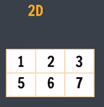. Ex: storing marks of multiple students (row-students, column-subject marks), RGB Arrays. Any 2D Array will have a total no. of cells = rows(n) x columns(m).

- Representation : 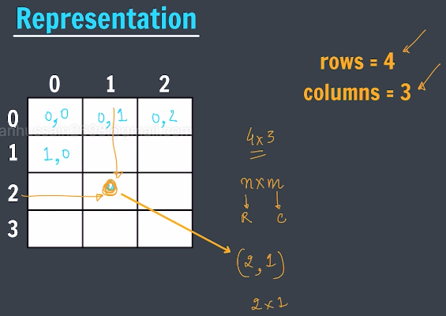
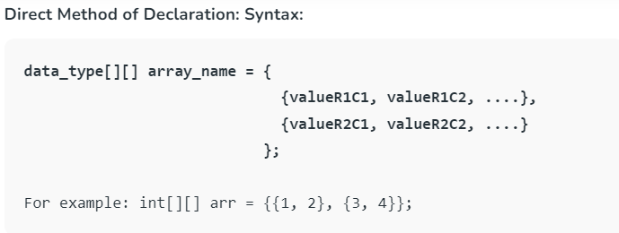
- Creation : 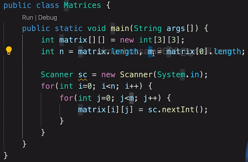
n = matrix.length -> Gives number of rows,
m = matrix[0].length; -> Gives number of columns in first row
- Print : 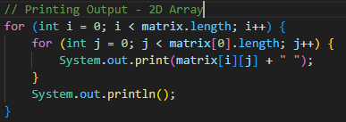
- Finding Key in 2D Array : 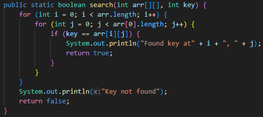 

# 2D Arrays in Memory
In a 2D array, row-major and column-major refer to different ways of organizing the elements in memory. Both ways stores in continuous manner. 
1. Row-major order : elements are arranged row by row. It means we fill the first row from left to right, then move to the next row, and so on. 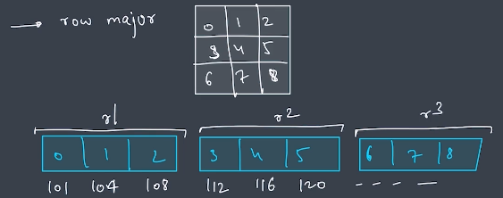!
2. Column-major order : elements are organized column by column. We fill the first column from top to bottom, then move to the next column, and so on. 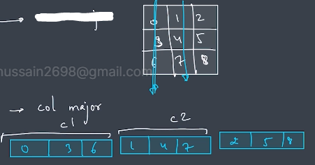

* But in Java 2D Arrays are neither stored in row-major/column-major manner. Whenever a 2D Array is created in Java of (n x m) order, individually 'n' number of (1D)arrays are created in linear fashion. 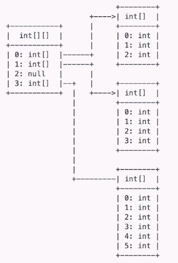 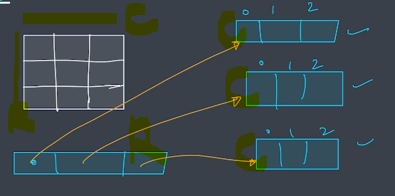. Also it isn't mandatory for the 2D Arrays to be stored in continuous fashion like in linear Arrays/row-major order/column-major order, coincindently it can be so but not neccesarily.

# Spiral Matrix 
Q. Given an m x n matrix, return all elements of the matrix in spiral order. (Asked in Amazon/Google/Adobe/Microsoft) 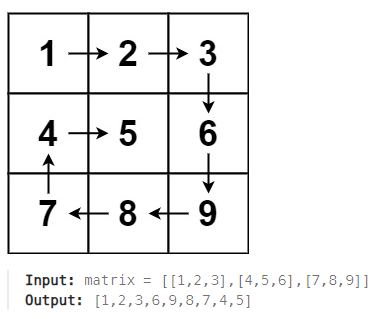
Ans. 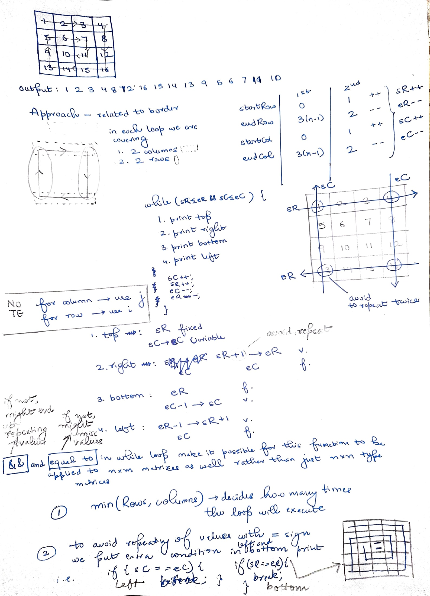

# Diagonal Sum in a Matrix
Q. For a given 2D square matrix of size (n x n), the task is to find the sum of elements in the Principal (starts from left top to bottom right) and Secondary (starts from right top to left bottom) diagonals.
Ans, 

# Search in Sorted Matrix
Q. Search for a key in row wise and column wise sorted matrix.
Ans. 
- Reference: https://takeuforward.org/arrays/search-in-a-row-and-column-wise-sorted-matrix/ (All three approaches explained - Brute/ Row-Wise Binary Search/ Staircase Search)

