# String

String is a derived data type that stores anything that can be represented in text form (i.e., characters, word, sentences, paragraphs, numbers etc.)

In Java, there is an existing inbuild class called String and this class is invoked everytime when we create a String data type/ data structure(arrays). Two methods to create string :

1. String variableName = "abcd"; (Directly intializing)
2. String variableName = new String("abcd");

The slight difference between these two statements occur on implementation level not on program level.

- Strings are IMMUTABLE in Java.

* sc.next() - This method reads the input only until a space(” “) is encountered. In other words, it finds and returns the next complete token from the scanner.
* sc.nextLine() - This method can read the input till the end of line. In other words, it can take input until the line change or new line and ends input of getting ‘\n’ or press enter.

# String Length

String class has a special function associated with it i.e., length(). Syntax: stringName.length()

- Unlike in array we write arrayName.length -> here length is treated as a property but in strings we use length as a function (i.e., with parenthesis). Reason: Certainly a length() method could have been defined on arrays, but the designers wanted to keep length as a property rather than a pseudo-method. (In part this may have made it easier for early Java implementations.) The reasons are somewhat buried in history.

# String Concatenate

Combining one string with another -> 

# String charAt Method

The String charAt() method returns the character at the specified index in a string. The Index of the first character in a string is 0, the second character is 1, and so on. The index value should lie between 0 and length() – 1.

Q1. Check if a string is a Palindrome. 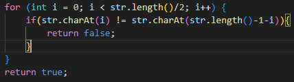 and 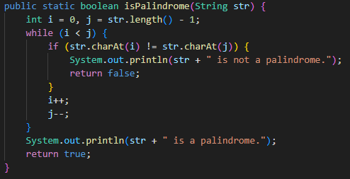
Q2. Given a route i.e., WNEENESENNN containing 4 directions (E, W, N, S), find the shortest path to reach destination. 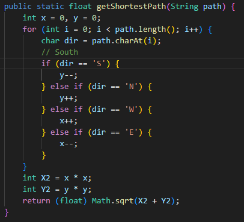

# Compare Strings

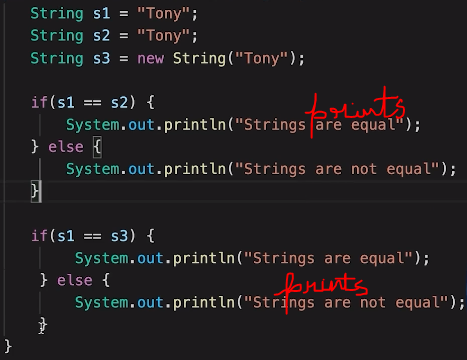. s1 and s2 seems to be equal whereas s1 and s3 seems to be unequal given all three variables stores the same value.

- Reason:

1.  s1 and s2 are equal because of interning in Java, i.e., if a string is created without the "new" keyword, then this string points to an old already created string with same value.
2.  s1 and s3 are not equal because when a string is declared with "new" keyword, a new string with the given value is created.

Hence it concludes that whenever we want to check the value of strings, using '==' isn't ideal as '==' checks whether two strings are same on object level or not. So for this we use a function String.equals() -> In Java, string equals() method compares the two given strings based on the data/content of the string. If all the contents of both the strings are same then it returns true. If any character does not match, then it returns false. 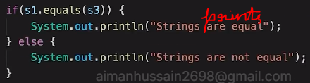

# Substring

The smaller string made up of consecutively occuring characters that are part of the bigger string. 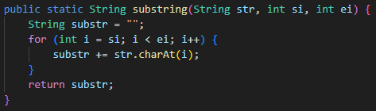. In Java, there exists an inbuild substring function, Syntax -> strName.substring(si, ei) (where ei is exclusive).

Q3. For a given set of strings, print the largest string in lexicographic order.
Ans. Will use compareTo() method here -> compares the given string with the current string lexicographically. It returns

1. if string1 > string2, it returns positive number
2. if string1 < string2, it returns negative number
3. if string1 == string2, it returns 0.
   It compares strings based on the Unicode value of each character in the strings.

Note: Another function alongside compareTo() is compareToIgnoreCase() method -> compares two strings lexicographically, ignoring lower case and upper case differences. The comparison is based on the Unicode value of each character in the string converted to lower case.

- Solution - 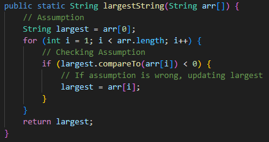
  TC - O(x \* N) (where x is the length of the string with maximum length in String array and N is the string array's length)

# Why Strings are immutable

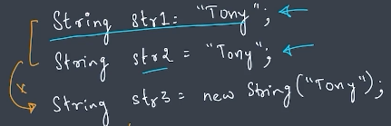. Here str1, str2, and str3 are refernce variables in stack memory pointing to string objects in heap memory.

1. What happens in memory with direct initialization - 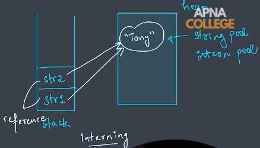.
2. What happens in memory with instantiation - 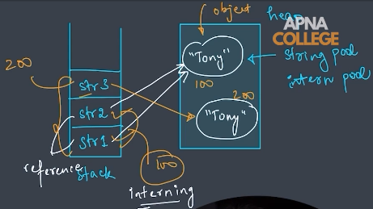

Reason: Strings in Java are specified as immutable, because strings with the same content share storage in a single pool to minimize creating a copy of the same value (interning). That is to say, once a String is generated, its content cannot be changed and hence changing content will lead to the creation of a new String. Otherwise, the update will affect the heap value, and then all other String references that share the same storage location will be changed. This change has the potential to be unpredictable, which is why it is not desirable.

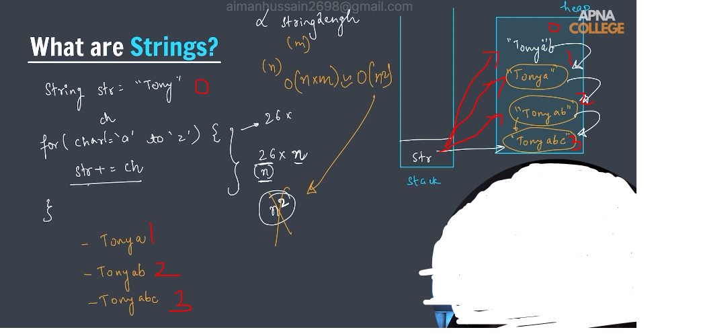

# StringBuilder

- Since the String Class in Java creates an immutable sequence of characters, the StringBuilder class provides an alternative to String Class, as it creates a mutable sequence of characters.
  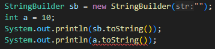 -> Here toString() method is used to get the string representation of an object since 'a' is a primitive data type and not a object, this method will not work on it. Whereas if 'a' was of an object of Integer class then this method would have worked.
- 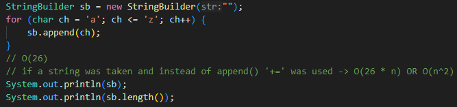
  append() - Appends (attaches) the provided value to the end of the current string content within a StringBuilder object. Stringbuilder class almost consists of all functions that a String class possesses (Ex- length())

Q4. For a given string convert each first letter of each word to uppercase.
Ans. 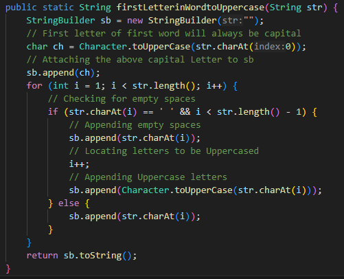
Using Character.toUppercase(ch) here - this is a method of Character class which converts the character argument to uppercase using case mapping information from the UnicodeData file. TC = O(n)

Q5. String Compression i.e., "aaabbcccdd" -> "a3b2c3d2"
Ans. 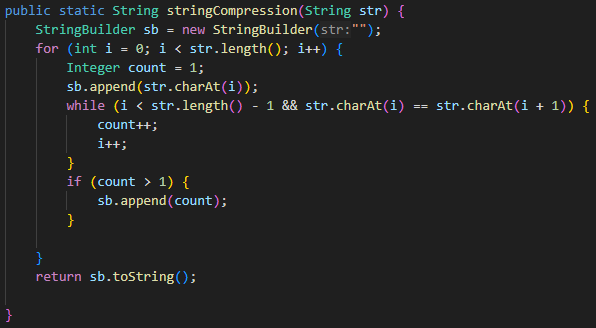

# HW Notes

- Question 5 Notes

* String literals: enclosed in double quotes ("example"); defined directly in your code, immutable, stored in SCP/SLP, efficient for fixed text.
* String objects: created at runtime using the new String() constructor or implicitly from string literals. Mutable (potentially), stored in heap, offer more flexibility.

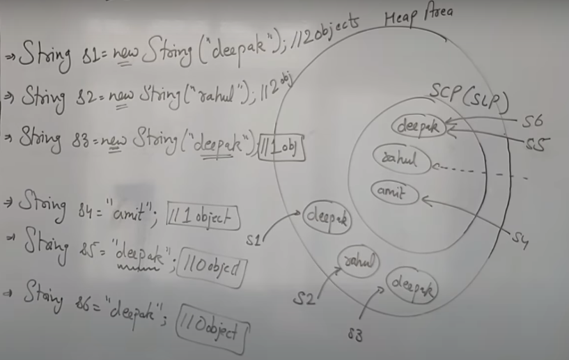

- Reference Video -> https://www.youtube.com/watch?v=UBYW08L3QRk , https://www.geeksforgeeks.org/string-constant-pool-in-java/

a. String name = new String ("Aiman");
String objects created with "new" keyword: Two creation takes place, one is String object in Heap Memory (Reference variable will point to this object) and another object of same value in SCP (is created if already not present) which is created due to the allocation of memory of string literal in SCP (JVM internally create reference point for this)
b. String name1 = "Tanvir";
An object is created directly in String Constant Pool(SCP)/String Literal Pool and the variable name1 will point to this object.

1. intern() method - is a method of the String class object that attempts to return a canonical representation of the string object. In simpler terms, it checks if a string with the same content already exists in the String Constant Pool (SCP) and, if so, returns a reference to that existing string object. Otherwise, it adds the string to the SCP and returns a reference to the newly added object.

In essence, the SCP acts like a built-in mechanism for string literal internment, avoiding the need for an intern() method at that level. The intern() method can still be beneficial in specific scenarios like Custom String Objects: If you're frequently creating String objects from user input or other dynamic sources, intern() can help check for existing matches in the SCP, potentially reducing memory usage for repeatedly encountered strings. In summary, the intern() method remains an option in Java, but the SCP's built-in reuse mechanisms often handle string literals effectively. Use intern() judiciously based on your specific needs and potential trade-offs.

2. StringBuffer Class

- Reference: https://www.youtube.com/watch?v=G4xQs6Tcsn4

Sidenote: StringBuffer Class creates mutable object, methods of this class were all synchronized methods which brought down the performance by increasing waiting time. Hence, StringBuilder class with mutable objects and non=synchronized methods were created by Java. 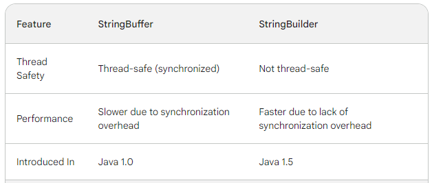

StringBuffer: Thread-safe. This means multiple threads can access and modify a StringBuffer object concurrently without causing data corruption. It achieves this by using synchronization, which adds some overhead.
StringBuilder: Not thread-safe. Only one thread can modify a StringBuilder object at a time. If multiple threads need to access a StringBuilder concurrently, external synchronization mechanisms are required to avoid issues. This makes StringBuilder generally faster than StringBuffer.
