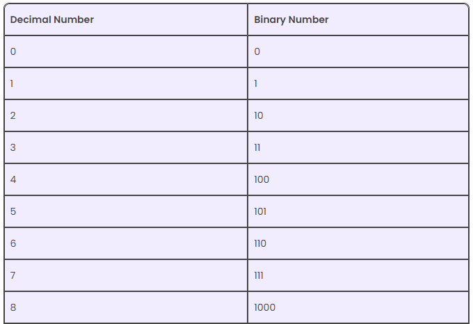
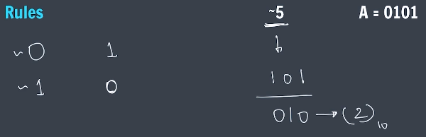

# Binary Number System (BNS)

All the information that is stored in computer is stored in BNS form i.e., 0 & 1.

# Decimal to Binary

- Note: 100 = 0100 = 00100 = 00000100 (in BNS). The number of 0s before a binary number doesn't affect it's value because the value starts from set bit (the bit at which 1 is encountered from left).

# Binary to Decimal

# Bit-wise Operators

(operators that perform operator on bits)

1. Binary AND ( & ) Operator -> 
2. Binary OR ( | ) Operator -> 
3. Binary XOR ( ^ ) Operator -> 
4. Binary 1's Complement (/NOT ( ~ ) Operator) -> operates on single bit 
   In theory, ~101 (/5 in DNS) = 010 (/2 in DNS) but on calculation it is giving -6.
   Reason: Inside computer's memory, the binary numbers are not simply represented in three bits they have some number of 0s towards the left end (i.e., modern day computer typically either has 32bit or 64bit to store BN depending on their computer architecture). Also two important concepts in BNs: most significant bit (MSB) and least significant bit (LSB).

- Most Significant Bit : leftmost bit, contributes most to the overall value of no. hence most significant. In two's complement notation (a common way to represent signed numbers in binary), the MSB is used to indicate the sign (positive or negative) of the number. 0 represent " + " and 1 represent " - ".
- Least Significant Bit : rightmost bit, contributes least to the overall value of no. hence least significant.

For explanation sake let's suppose in memory 5 is represented as : 0 0 0 0 0 1 0 1
1s Complement of 5 i.e., ~5 : 1 1 1 1 1 0 1 0 (Decimal number = 250; Decimal from signed 2s complement = -6) -> the answer printing on computer screen as a result of this operation is -6 because modern day computers use two's complement method to handle signed numbers using bitwise operations(hence ~5 = -6). Whenever we want to calculate the actual value of a negative number, we use 2s complement method 

* Method of 2s Complement: Invert (+) Add 1 (+) Sign Extension(for -ve no.):

  - Flip all the bits (0s to 1s and 1s to 0s) of the original BN (i.e., ~5 here). This is the 1's complement. Ex: ~5 -> 1 1 1 1 1 0 1 0. On inverting becomes -> 0 0 0 0 0 1 0 1.
  - Add 1 to the least significant bit (LSB) of the 1's complement. Ex (continue): 0 0 0 0 0 1 0 1 + 1 = 0 0 0 0 0 1 1 0 (magnitude of this is 6).
  - Since the MSB in begining was 1, hence this number is -6. Similarly, the number becomes positive if MSB is 0.

* ~ 0 = - 1

5. Binary Left Shift ( a << b ) Operator -> Left shifts/moves all bits (a) by given number of spaces (b) and inserting 0 in the remaining blank spaces in rightmost end. .
   - a << b = a * 2^b
6. Binary Right Shift ( >> ) Operator -> Right shifts/moves all bits (a) by a given number of spaces (b) and inserting 0 in the remaining blank spaces in leftmost end. 
   - a >> b = a / 2^b

Ques. Check if a number is Odd or Even.
Ans. Hint: . Any binary number when &nd with 1 ( bitMask) reverts only the LSB of the said binary number making all other bits 0.

- 

# Operations on Bits

* Note - Keep in mind LSB is 0th bit i.e. 1<<0 = 1 ( 0 0 0 1 ) eventually 

1. Get ith bit -> i.e., get the value (0 or 1) of the i-th bit in a binary number.
   Method: AND operation with bitmask (1<<i), if a non zero number is returned then ith bit should have been 1 originally else it was 0.

   - 

2. Set ith bit -> to set the i-th bit (to 1) in a binary number.
   Method: OR operation with bitmask (1<<i).

   - 

3. Clear ith bit -> to clear the i-th bit (set it to 0) in a binary number.
   Method: AND operation with bitmask (~(1<<i)).

   - 

4. Update ith bit -> either to clear if the update bit is 0 or to set if the the update bit is 1.  
   - . 

   Alternate Method: Updating the i-th bit in a binary number involves two main steps: 
      * Clearing the i-th bit 
      * Setting the i-th bit to the desired value (0 or 1). 
   - 

5. Clear last ith bits -> to cleare last i bits in a number refers to setting those bits to 0 in its binary representation. 
   - 

6. Clear range of bits -> to cleare a range of bits in a number refers to setting a specific group of bits (from i to j) to 0 within its binary representation.  + 
   - 

Ques. Check if a number is power of 2 or not.
Ans. Hint:  
   - 

* Note - Any number n to represent on binary it takes (log n) OR (log n + 1) bits. 

Ques. Count set bits in a number.
Ans. Hint:  This loop will run (log n) times because we are running the loop on all the represented bits of the number (i.e., n)
   -  : My method. 
   -  : Apna College method. 

# Fast Exponentiation
An algorithms that compute a number raised to a power much faster than simply multiplying the base by itself repeatedly i.e., bringing down the time complexity of O(n) (in naive approach) -> O(log n)
Example : a ^ (5)
1. Convert power raised to the base into binary form a ^ (101)
2. Now associating every bit in this binary form with a multiple of power 2 with same bas. 
3. As we go from left to right, we calculate the overall product by multiplying bits and powers associated with them (where bit is 0, we take this its multiplication as 1 in overall product)
