# Object and Classes

1. Objects: entities in real world; instances of a class. 
2. Classes: set of objects which shares common characteristics/behavior and common properties/attributes OR a group of objects(above entities) having similar properties and behavior; it is a user-defined blueprint or prototype from which objects are created. 

For example, 
- The animal type Dog is a class while a particular dog named Tommy is an object of the Dog class.  
- Student is a class while a particular student named Aiman is an object. 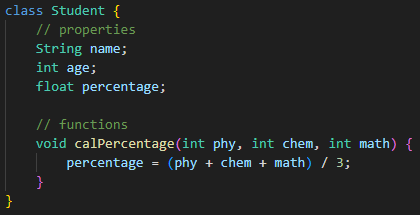
- Protoype of Maruti 800 is a class and each M800 produced as a result of this prototype is an object.

* Important points
    - By convention names of java classes start with capital letters and that of functions with small letter. 
    - A single java file can contain multiple classes. 
    - Placing non-public classes below the public class declaration helps prevent errors.
    - To access properties and functions of an object we use dot operator
    - By convention, developers often place the main function in a public class with the same name as the file. This makes the application easier to run and aligns with common practices; main Function: is the entry point for your Java application. JVM searches for this method to start program execution.

Classes contains some behavior/functions and properties/attributes -> 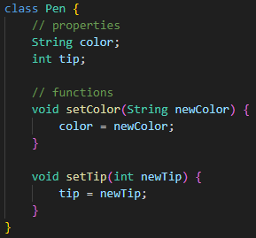.
By the above code a blueprint of pen is created but an actual pen is not yet created. For to create an object of Pen class we further write code in memory as such -> 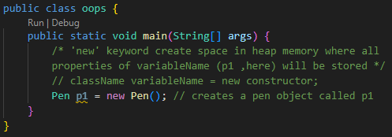.Further assigning values to this instance of class pen [Storing values using fucntions in properties of objects](penObjectA.png) 

# Access Modifiers
Access Modifiers/Specifiers define access of any object/classes, methods, and other members of a class. 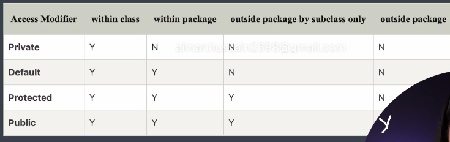

# Getters & Setters
Getters and setters are special methods used in OOP to control access to an object's attributes/properties
1. Getters(/Accessors): 
    - Purpose: Allows you to retrieve the value of an object's attribute.
    - Convention: Typically named with the prefix get followed by the attribute name (e.g., getName()).
    - Return value: The value of the attribute.
2. Setters(/Mutators): 
    - Purpose: Allows you to modify the value of an object's attribute.
    - Convention: Typically named with the prefix set followed by the attribute name (e.g., setName()).
    - Parameters: Take one or more arguments, usually representing the new value for the attribute.

At first glance, getters and setters might seem to contradict the idea of access modifiers, particularly private. But that's not entirely the case. Access Modifiers restrict direct access to an object's attributes from outside the class. They provide first layer of security.
G and S methods control how attributes are accessed and modified even if they are public. They offer a more granular level of control.

* Note - 'this' keyword is used to refer to the current object.

# First Pillars of OOPs (Encapsulation)
- Encapsulation - is defined as the wrapping of data and methods under a single unit (i.e., class). It uses access specifiers (like private, protected, default) which implements data hiding. Think of a capsule containing medicine; the capsule (object) protects the medicine (data) while providing a way to consume it (methods).

# Constructor: 
is a special method which is invoked automatically at the time of object creation.
- Constructors have the same name as class or structure
- Constructors don't have a return type (not even void)
- Constructors are only called once, at object creation or initialization.
- Memory allocation only happens when constructor is called.
- A class can contain multiple types of constructors based on our requirement (Constructor Overloading) -> can create objects of the same class in various ways, providing the necessary information at creation time.

Note: In java, if a class doesn't explicitly define a constructor at all, Java provides a default no-argument/non-parameterized constructor that typically initializes primitive data types to 0 or false and reference types to null. Remember, a default constructor is only created by Java if no constructor already exists in class. But initialization can't be done in these default created constructors, for initialization user needs to self create a (parameterized) constructor. 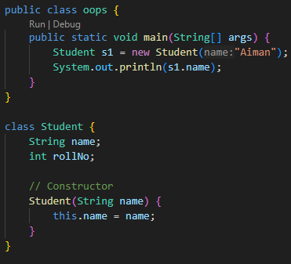

# Types of Constructors
1. Non-parameterized: It doesn't take any arguments/parameters when creating the object. 
2. Parameterized: this type allows you to provide arguments (like instructions) during object creation. These arguments are used to initialize the object's attributes with specific values.
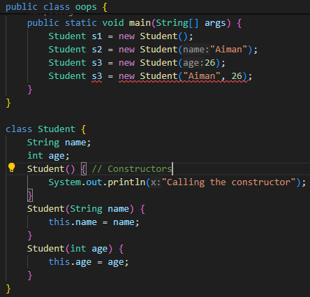.
3. Copy Constructor: used to create a new object as a copy of an existing object. It takes an existing object of the same class as an argument and initializes the new object with the same values as the original. Syntax: ClassName(ClassName otherObject). 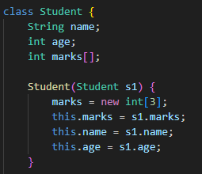

Changes made in the existing object(s1) after object creation(s2) using copy constructor, reflects in s2 as well -> 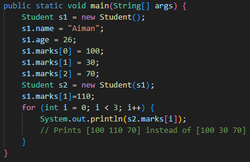.  Why? -> 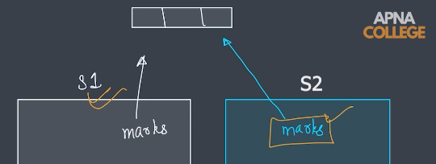

# Shallow & Deep Copy
- Shallow Copy - a new object is created with copies of the primitive data types and references to the objects held by the original object. Changes reflect.
- Deep Copy -  a new object is created with entirely independent copies of all its data (i.e., primitive data types and refernces to objects). Changes don't reflect. If Student copy constructor is updated to make a deep copy 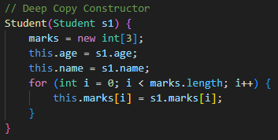 and the same code of copy constructor runs i.e. 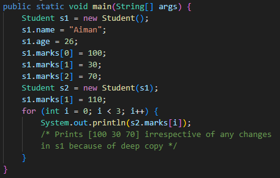 no changes reflect in the new object.

* Lazy Copy (Additional) - Lazy copy, aka copy-on-write (COW), optimization technique for copying objects. It's a combination of shallow copy and deep copy.

Idea Behind Lazy Copy:
- When you create a copy of an object using lazy copy, initially, a shallow copy is performed. 
- However, a counter or flag is also maintained to track how many objects share this data.
- As long as the original and copied objects remain unmodified, there's no need to perform a deep copy
- If one of the objects needs to be modified, only then does the lazy copy mechanism trigger a deep copy. 

# Destructors
Java doesn't have destructors in the same way that languages like C++ or Python do. In Java, memory management is handled automatically by the garbage collector. 

# Second Pillar of OOPs (Inheritance)
- Inheritance: is when properties and methods of base(/parent) class are passed onto a derived(/child) class. 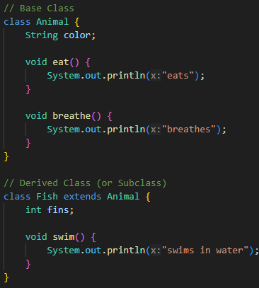. Meanwhile what happens in main class as a result of this inheritance 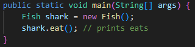

extends keyword -> allows you to create new classes (subclasses) that inherit properties and behaviors from existing classes (superclasses). 

# Types of Inheritance
1. Single Level Inheritance - when a single subclass inherits properties and behaviors from one another single superclass. 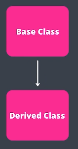
2. Multi Level Inheritance - when a subclass inherits properties and behaviors from another superclass, which itself inherits from yet another class (grand superclass) i.e., chain of inheritance with multiple levels. 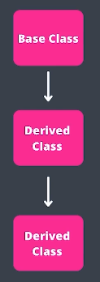 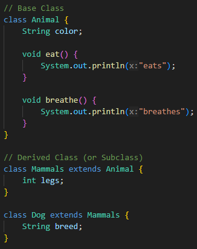
3. Hierarchial Inheritance - creates a hierarchy/tree-like relationship between classes. When single base class (superclass) acts as the parent, and multiple derived classes (subclasses) inherit properties and behaviors from it.S 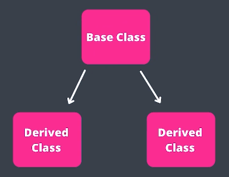  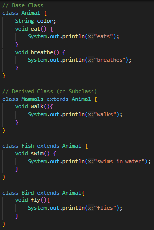
4. Hybrid Inheritance - when you combine multiple inheritance techniques within your class hierarchy (ike single, multi-level, or hierarchical inheritance)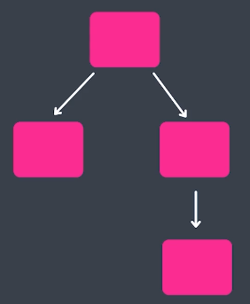 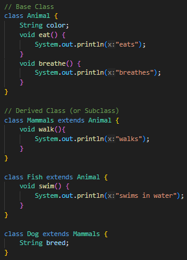

# Third Pillar of OOPS (Polymorphism)
- Polymorphism: poly(many) + morphism(forms) -> when we try to achieve the same thing in multiple forms; OR ability of objects to exhibit different behaviors in response to the same method call.

# Types of Polymorphism
1. Compile-time Polymorphism (Method Overloading) - Multiple functions with the same name but different parameters. Compiler determines which method to call based on the number and types of arguments provided at compile time (function overloading). 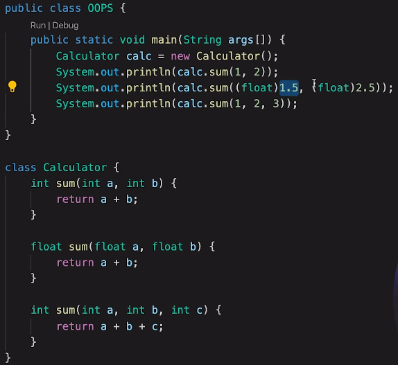  
2. Runtime Polymorphism (Method Overriding) - Parent and child classes both contain the same function with a different definition; involves inheritance, where subclasses can override methods inherited from their superclass. At runtime, the actual object type (subclass) determines which method implementation is called.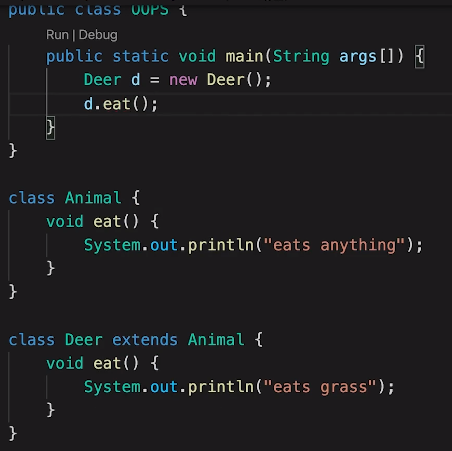

# Packages in Java
Package in a group of similar types of classes, interfaces and sub-packages. Acts like folders in a file system, grouping related functionalities together and preventing naming conflicts.

- Types of Packages:

    - Built-in Packages (Java API): collection of pre-written classes and interfaces organized into packages like java.lang, java.util, java.net, etc. 
    - User-defined Packages: You can create your own packages to organize your custom classes and interfaces.
    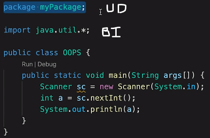

# Fourth Pillar of OOPS (Abstraction)
- Abstraction: Hiding all the unnecessary (implementation) details and showing only the important parts (essential features and functionalities of an object ,i.e., only giving an idea to how things are particularly implemented) to the user. As we use 'extend' keyword for class, 'implement' keyword for interface. 

* Encapsulation vs Abstraction - Encapsulation is about securing an object's internal state. Abstraction is about presenting a simplified view of an object's functionalities.

Abstraction in OOPs are implemented in two ways:
1. Abstract Classes 
    - Can have abstract/non-abstract methods 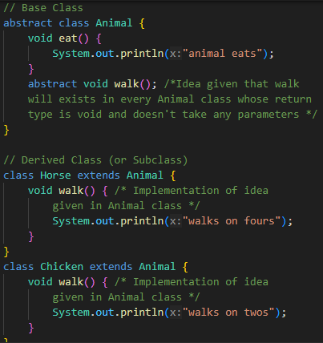
    - Cannot create an instance of abstract class 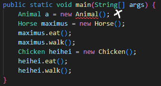
    - Can have constructors - in creation of object of a subclass , constructors are called in a specific order; constructor of the most distant superclass (the one at the root of the inheritance hierarchy) is called first and so on. Finally, the constructor of the immediate subclass (the class you're using to create the object) is called. So, constructor in the abstract class can be used to initialize common fields or perform setup tasks that will be inherited by all subclasses. This ensures consistent initialization across subclasses. 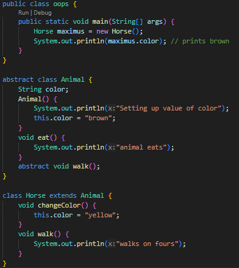
    
2. Interfaces - blueprint of a class; need of interfaces in Java because of multiple inheritance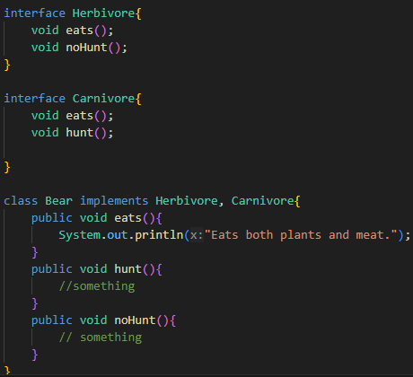 and total abstraction. 
    - All methods are public, abstract and without implementation. 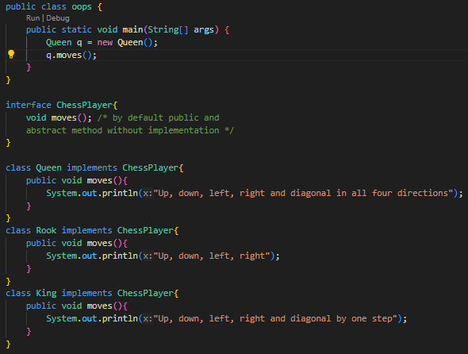
    - Used to achieve total abstraction.
    - Variables in the interface are final (substitute for const), public and static. 

# Static keyword
'static' keyword is used when a class is to share the same variable or method for each of it's instance(/object). static keyword is a non-access modifier. It defines how members of a class are accessed and stored in memory. 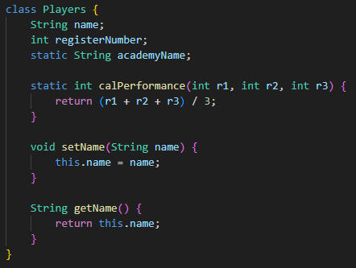

Things in Java that can be made static:

- Static Variables (Class Variables): Declared with the static keyword within a class; there exists only one copy of the variable shared by all instances (objects) of the class; Accessed using the class name, not the object reference (e.g., ClassName.staticVariable).
- Static Methods (Class Methods): Declared with the static keyword within a class; don't require an object of the class to be called. Invoked using the class name itself; usually operate on the class itself or utilize static variables of the class.
- Blocks of Code
- Nested Class

If the static variable defined in a class is declared/changed by any object of this class then it will change for everyone other object (created/uncreated) too. As shown, p2 is a new object created but it will also print "JSC" as static variable 'academyName' is already defined by p1 object before then p3.academyName will print "ECC" as the value was changed after declaring it to "JSC"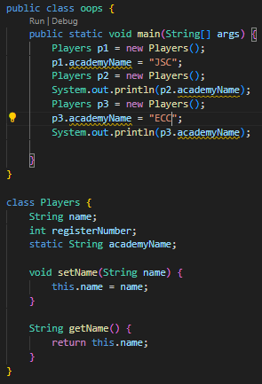 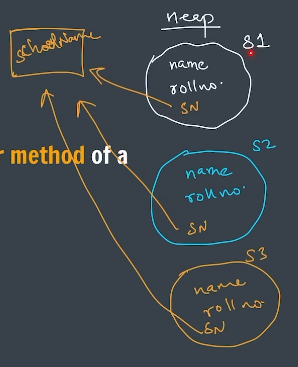

# super Keyword
used to refer immediate parent class object
Three tasks 'super' keyword performs:
1. to access parent's properties 
2. to access parent's functions 
3. to access parent's constructors 

# Constructor Chaining

# Solved Questions Practice
- Which access modifiers are not allowed in front of class? Whenever a class is made Private, protected it becomes unusable. 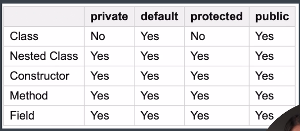
- 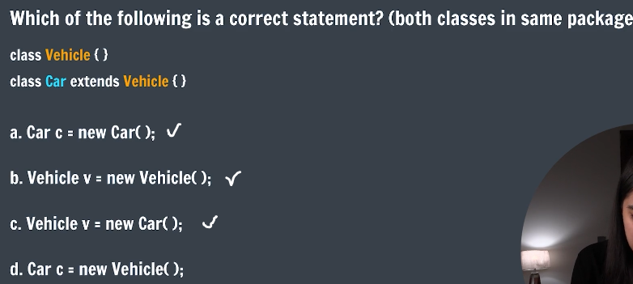 The reason (c) is also correct is in this question is because assigning a child object to a parent reference variable is a common technique; When you assign a child object to a parent reference variable, you store the memory address of the child object(right side) in the parent reference variable(left side). 

# HW 

- Q4 Explanation 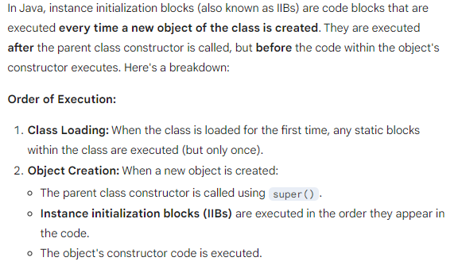