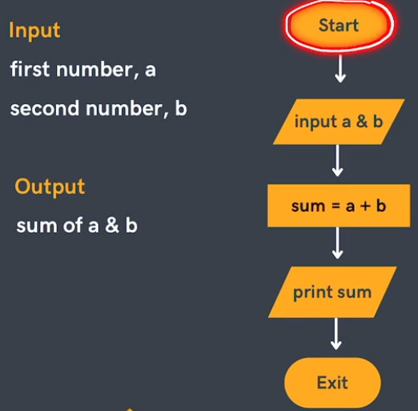
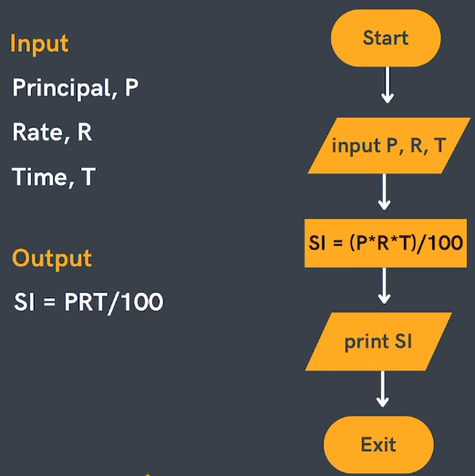
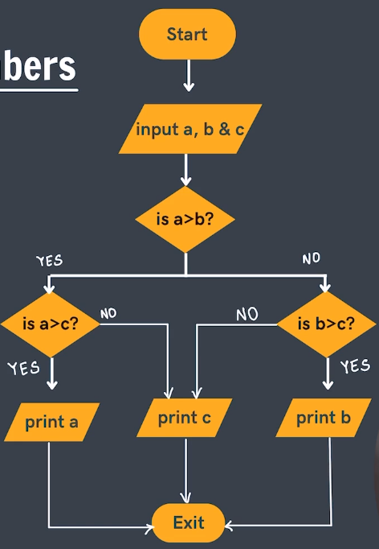
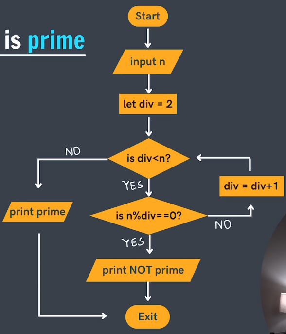

# Flowcharts 
Diagrams to represent solutions of problems. Every individual solution is first divided in smaller parts and then further logically arranged in order.

# Components in Flowcharts
Components are basically building boxes for a flowchart

* Reference: 
1. https://www.tutorialspoint.com/programming_methodologies/programming_methodologies_flowchart_elements.htm
2. https://www.geeksforgeeks.org/what-is-pseudocode-a-complete-tutorial/

Problems
1. Sum of two Numbers  
2. Calculate Simple Interest 
3. Find max of three numbers 
4. Find if number is prime 
5. Sum of "n" natural numbers

Practice Problems
1. Flowchart to print the Even numbers between 9 and 100
2. Flowchart for calculating the average from 25 exam scores
3. Find all the roots of a quadratic equation (OptionalQs)