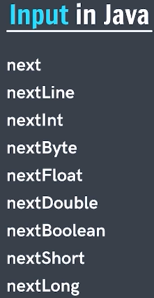
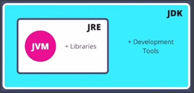
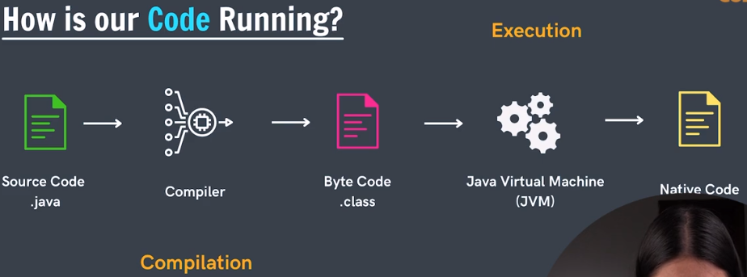

Every file has its own extension which tells us what does the file contain. Example: a java file is written as "abc.java".

The entire code in filename.java file is written in a class defined under "public class class_name" , where class_name should be same as filename. In this mentioned class we write all the code and all the work in regard to this code is performed in this class. A function is always defined in the above class as "public static void main(String args[]){ }". "main" function is the first thing a Java compiler searches for whenever it wants to execute Java code. 

Any Java code when written will always consists of two features
1. define a public class
2. create a main function 
, these features will constitute a boiler plate template code for any Java code. The context in main function is the main body (main code) of our entire boiler plate template.  

# Output in Java
1. " System.out.print( "Hello World" ); " --> is a method/statement which prints the argument passed to it. The println() method display results on the monitor. 
2. " System.out.println( "Hello World" ); " --> same as above but because of "ln" a new line of space is introduced after printing output. 
3. "\n" --> same feature as point 2.

To run a Java code
1. we compile first using command "javac filname" --> implies that we are calling Java compiler
2. run code using command "java filename", in VSCode we don't always compile and run. In most cases, we simply run code because in this specific code editor simply running code means automatically compiling and then running itself.

# Variables in 
There are two types of units in Java, i.e., Literals and Variables. 
 
Values that don't change and are always same are called literals or Literals are constant values assigned to constant variables. There are several types of literals:
1. Number Literals: 1, 2, etc
2. Character Literals: 'a', 'b', '@', '*' etc

Variables are basically containers in Java whose internal values can change. To define variables in Java we first mention their type, Example: int a = 10 (variableType variableName = variableValue) etc. Names given to a class (JavaBasics), variable ("a"), package ("PartB), method (print()), or interface which in turn allows the programmer to refer/identify some specific item from any place in the program are called Identifiers.

* What happens in Memory when a Variable is created in Java
Example: int a = 25; --> this means a block is created in memory by the name 'a' and in it value 25 is stored (similar for all data types). All these created blocks in memory has distinctive addresses and the size of these blocks also depends on data types that are stored

# Data Types in Java
* Reference : https://www.freecodecamp.org/news/java-data-types-and-variables/
Java has two types of data types:
1. Primitive Type: already exists(inbuilded) in Java language. User not required to create on their own.
2. Non-Primitive (/Reference) Data Type: User defined data types.
Java is a typed language i.e., before creating (/defining) any variable in Java it should be mentioned beforehand what is the type of this variable. All primitive data types start with small letters.  

# Why we need different Data Types in Java?
As each data type has their own respective size and as per the size of each data type, respective spaces are allotted in the memory. Smaller the data type size, smaller is the space allotted in memory and vice versa. The space given in memory is measured in terms of bytes. 1 byte = 8 bits. Each bit implies single information (i.e., either 0 or 1)
* Size of Each Data Type: (Refer to the table: https://www.geeksforgeeks.org/data-types-in-java/)

# Input in Java (How to input data from the user)   
We use "Scanner" class for this purpose. Java Scanner class is part of the java. util package. The Scanner is mostly used to receive (/capture) user input and parse (/store) them into primitive data types such as int, double or default String. 
1. Example: Scanner sc = new Scanner(System.in); String input = sc.next(); --> captures single word input. 
2. To capture entire line we use nextLine() method with Scanner class, i.e., Scanner sc = new Scanner(System.in); String input = sc.nextLine();.
3. Similarly for number --> Scanner sc = new Scanner(System.in); int input = sc.nextInt();
Whichever type of value we wish to input correspondingly we will use specific functions --> 

Note: Java automatically considers any decimal value to be double if it is not specified if it is float or double first. To remedy that if a value is floating in nature and we haven't specified yet, we simply introduce an "f" at the end of the number. 

# Type Conversion (or Widening/Implicit Conversion)
When one type of data is converted into another type of data. Type conversion is a conversion which Java automatically (implicitly) does itself. Such a conversion only happens when:
1. types are compatible -->
2. destination type > source type ;

# Type Casting (or Narrowing/Explicit Conversation)
The process of downsizing a bigger data type into a smaller one is known as type casting (explicit conversation). Doesn’t happen by itself. If we don’t explicitly(forcibly) do that, a compile-time error will occur. Type casting is unsafe because data loss might happen due to the lower data type’s smaller range of permitted values. A cast operator assists in the process of explicit casting.

Note: It is possible to convert a character in int in Java.

# Type Promotion in Expressions
1. Java automatically promotes each byte, short, or char operand to int when evaluating an expression.
2. If one operand is long, float or double the whole expression is promoted to long, float or double respectively.
Example: 
* byte b = 5; b = b * 2; (second statement incorrect)
* byte b = 5; b = (byte) (b * 2); (second statement correct)

# How is Our Code Running
1. 
2.  - Unlike C++, Java is a portable language.
