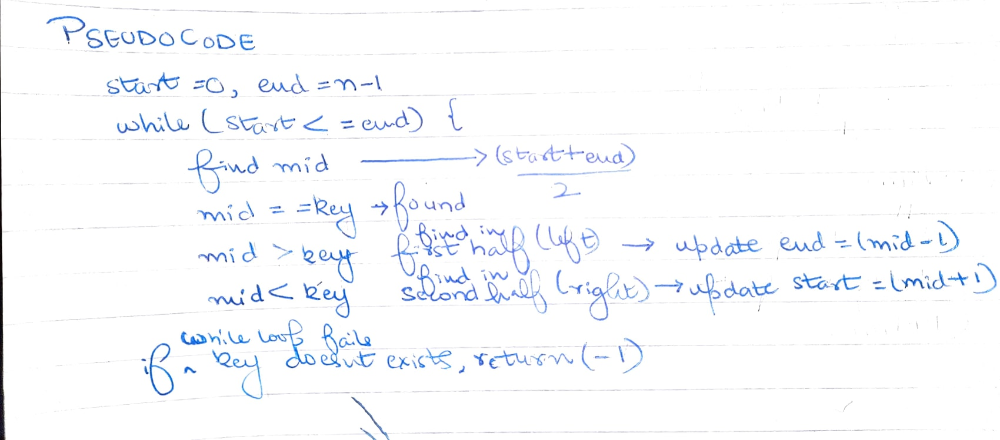
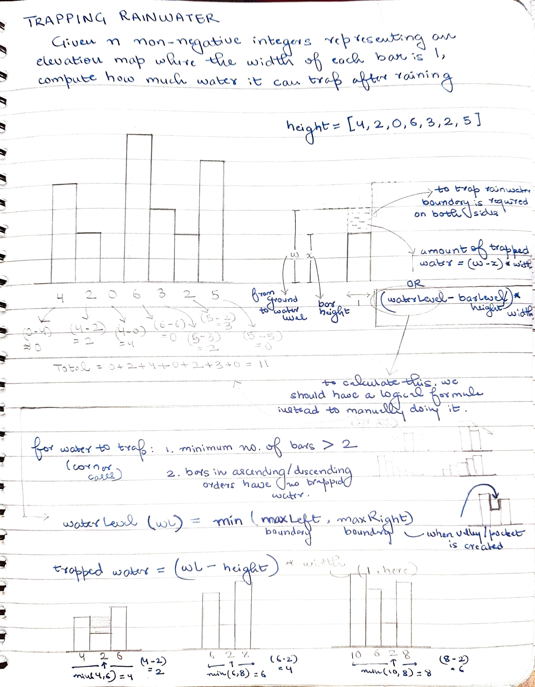
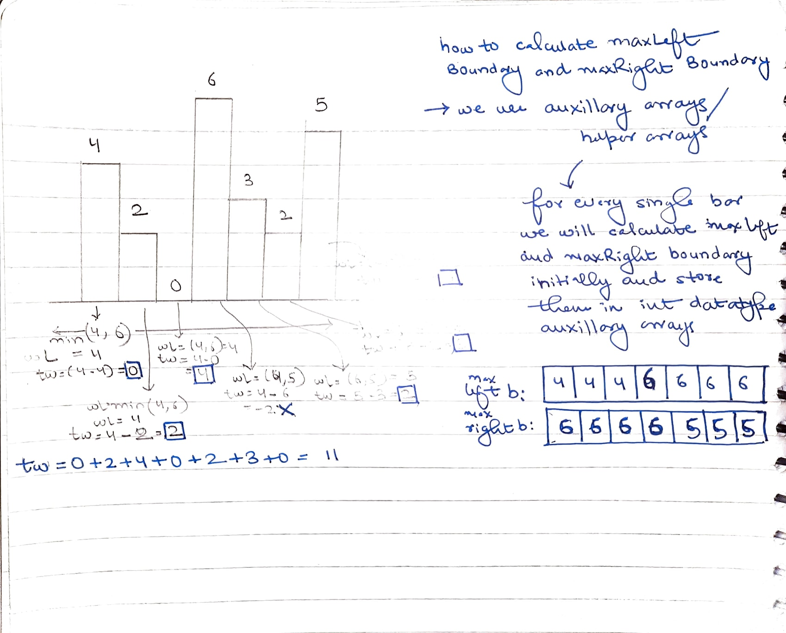
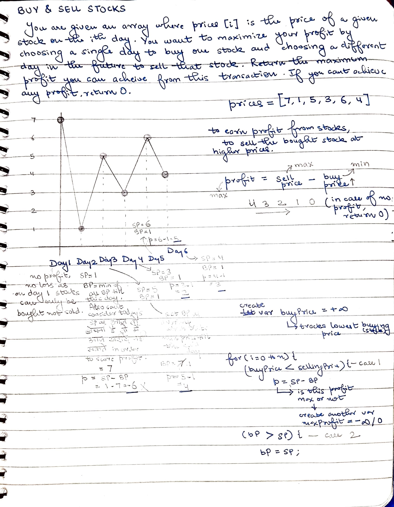

# Arrays 
List type structure. Zero based indexing.

* Def: List of elements of the same data type placed in a contiguous memory location. 

# Operations in Arrays
1. Create

Syntax: dataType arrayName[] = new dataType[size];
LHS alone will not create an array, LHS is only declaration that an array will be created. RHS is where the said array is physically created with the help of "new" keyword. "new" keyword finds us a location from computer memory where we later create our data structure.
Once array's size is declared it can't be changed at runtime. Example: int marks[] = new int[50]; int num[] = { 1, 2, 3 };

2. Input/Output

3. Update (Passing arrays as argument)
Arrays are passed by reference in methods/functions.

# Time Complexity (TC)
The amount of time required by a program to run/execute is called time complexity. Less the TC, faster the program.

# Linear Search
TC of linear search is O(n).

* Find Largest Number - compare with negative infinity (Integer.MIN_VALUE)

# Binary Search 
(Generally asked in Interviews) Pre-requisite for BS is a sorted array. Pseudocode for BC - . TC of binary search is O(logn).

* Formula for (distinctive) pairs in an Array for n elements = (n(n-1)/2)

# Print Subarrays
Subarray : a continuous part of array. Total number of subarrays with n elements, n(n+1)/2.

# Print Max Subarray Sums
1. Brute Force - O(n^3) 
2. Prefix Sum - O(n^2) ( prefix[j/end] - prefix[i-1/start-1] ) 
3. Kedane's Algorithm - O(n)
Concept : To maintain two variables: maxSum and currentSum. MaxSum variable tracks the maximum subarray sum found so far, while currentSum tracks maximum subarray sum ending at the current position.

The algorithm iterates through the array and updates the currentSum variable at each position. If the currentSum variable becomes negative, it is reset to zero, as a negative subarray sum cannot contribute to the maximum subarray sum. The maxSum variable is updated if the currentSum variable is greater than it. At the end of the iteration, the maxSum variable contains the maximum subarray sum.

# Trapping Rainwater (DSA Sheet Q22)
1. Calculate leftmax Boundary
2. Calculate rightmax Boundary
3. Loop (for each i, waterLevel = min(leftmax,rightmax); tw = wL - height[i]);

# Buy & Sell Stocks

# HW. Array Assigment 
- Q2 
1. https://takeuforward.org/data-structure/search-element-in-a-rotated-sorted-array/
2. For simply rotating an array at any given index -> https://www.geeksforgeeks.org/array-rotation/

