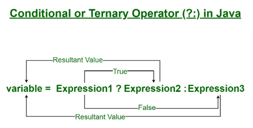

# Conditional Statements 
used to make decisions in a program based on some specific conditions.

# Types of Conditional Statements
Different types of CS are widely used according to their syntaxes and use cases:
1. if-else Statement 
2. else-if Statement

# Ternary Operator
Java ternary operator is the only conditional operator that takes three operands. It’s a one-liner replacement for the if-then-else statement. Syntax : variable = condition? statment1 : statement2; 

# Switch Statement
Executes one statement from multiple conditions. It is like an if-else-if ladder statement. For syntax: https://www.geeksforgeeks.org/switch-statement-in-java/

